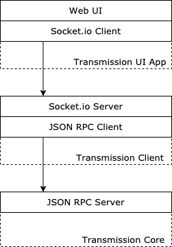

# Transmission Client


This is a modern and fresh transmission client written in typescript, golang and socket.io as communication layer.

## Motivation

### Just a context

I have a raspberry with [balenaOS](https://www.balena.io/os/) installed in it.
I started playing with it, installing some services like [Plex](https://www.plex.tv/) and [Samba](https://www.samba.org/)
to transfer files from my computer to the hard drive connected to the rpi.

I started downloading torrents from internet in my computer and then i would upload those files to my rpi using samba.
Determined to don't deal again with this painful "flow", i installed [transmission](https://transmissionbt.com/) in my rpi
and download directly to my external hard drive. It works perfectly but its interface it's a bit ugly.

Based on this ~brief~ summary, the motivation of this project are:

1. Just for fun
2. Improve my golang skills
3. Offer a modern and fresh transmission client alternative to the community

> If you are enjoying the experience with transmission like me, join to this project and let's improve it together.

## Architecture



## Configuration

The following table describes the available configurations, with its respective environment variable.

| Name |  Description | Env variable | Default |
|---|---|---|---|
| `username`   | Transmission username | `T_USERNAME` | `""` |
| `password`   | Transmission password  | `T_PASSWORD` | `""` |
| `server_url` | Transmission server URL | `T_SERVER_URL` | `""` |
| `theme`      | Used by the app to define the look and feel of the application (light, dark) | `T_THEME` | `"light"` |

## Installation

### Using Docker
```
docker run -d \
    -e T_USERNAME=transmission \
    -e T_PASSWORD=secret \
    -e T_SERVER_URL=http://localhost:9091/transmission/rpc \
    -e T_THEME=dark \
    -p 8000:8000 mfuentesg/transmission-client
```

## Development

This repository consists in two parts, server side and ui.

- Client side is built in `typescript` based on `create-react-app` command. (`ui` folder)
- Server side is built in `golang`

## Pending tasks

- [ ] Enable app to be used as desktop app
- [ ] Improve documentation